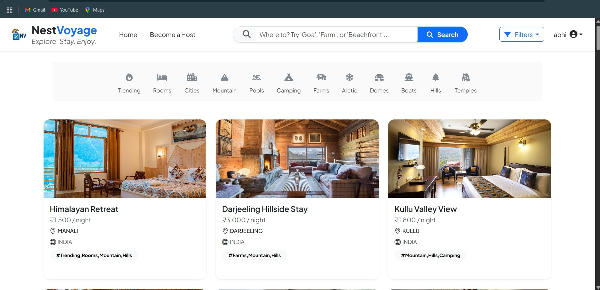

# 🏡 **NestVoyage**

**NestVoyage** is a full-stack rental platform where users can **explore properties**, **create their own listings**, **leave reviews**, and **connect with owners** for bookings.

> Built using **Node.js**, **Express**, **MongoDB**, **EJS**, and **Cloudinary**, with **Passport.js** for secure authentication, NestVoyage offers a smooth and responsive rental experience.

---

---

## 🌟 **Key Features**

- 🔐 **Authentication** — User registration, login, and session management.  
- 🏠 **Property Listings** — Registered users can add their own property listings.
- ✏️ **Listing Management** — Users can **edit or delete only their own listings**.
- 💬 **Reviews & Comments** — Add reviews to listings and read others' feedback.
- 📞 **Connect with Owners** — View listing details and contact owners for bookings.
- 🔍 **Search & Filters** — Find listings using filters like **location, price, and rating**.
- 🖼️ **Image Uploads** — Upload property images via **Cloudinary**.
- 🌐 **Guest Access** — Browse listings without logging in.
- 📱 **Responsive Design** — Fully mobile-friendly interface using **Bootstrap**.
- 🧠 **MVC Pattern** — Structured backend using **Model-View-Controller** architecture.

---

## 🛠️ **Tech Stack**

| Layer        | Technologies                                |
|--------------|---------------------------------------------|
| **Frontend** | HTML5, CSS3, JavaScript, Bootstrap 5        |
| **Backend**  | Node.js, Express.js                         |
| **Database** | MongoDB with Mongoose                       |
| **Auth**     | Passport.js, bcrypt.js                      |
| **Uploads**  | Cloudinary                                  |
| **Templates**| EJS                                         |

---


## 🚀 **Getting Started**

### 🔧 1. Clone the Repository

```bash
git clone https://github.com/abhishek5703/nestvoyage.git
cd nestvoyage
```

 2. Install Dependencies
 ```bash
npm install
```
3. Create .env File
```
MONGODB_URI=your_mongo_uri
CLOUDINARY_CLOUD_NAME=your_cloud_name
CLOUDINARY_API_KEY=your_api_key
CLOUDINARY_API_SECRET=your_api_secret
SESSION_SECRET=your_secret
```
▶️ 4. Start the Server
```
npm start
```
App will run at: http://localhost:3000

🧪 **How to Use**
```
📝 Register/Login to create and manage your listings.

🏠 Post a Property with images, details, and contact info.

✏️ Edit or Delete your own listings anytime.

💬 Add Reviews to listings and read community feedback.

📞 Receive Booking Inquiries via your listing’s contact info.

🔍 Search Properties using filters for price, location, and more.

👀 Browse Freely — No login required to view listings.
```


---

## 📸 Demo Screenshot

Here's a preview of the NestVoyage listings page with search and filters:



---

🤝 Contributing
Pull requests are welcome!
For major changes, please open an issue first to discuss what you’d like to change.
To contribute:

1. Fork the repo

2. Create a new branch (git checkout -b feature-name)

3. Commit your changes

4. Push to your fork

5. Open a pull request


For significant changes, open an issue first to discuss your proposal.

📬 Contact
 Developer: Abhishek Kumar

📧 Email: abhikumar898307@gmail.com

🌐 GitHub: github.com/abhishek5703

✨ Crafted with care to make renting homes simple, smooth, and secure.
